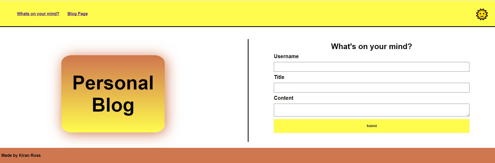
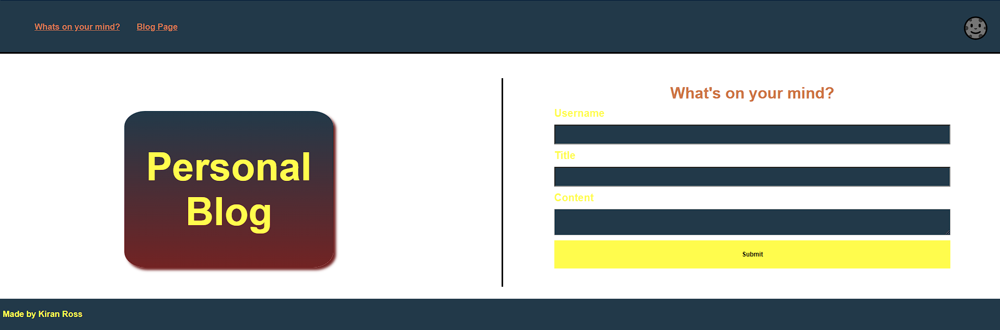
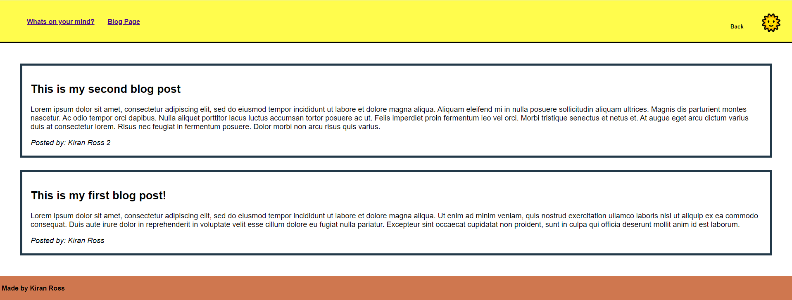

# My first blog

## Descirption
This week's challenge revolved around JavaScript. My challenge was to create a simple blog page that utilises various JavaScript functionalities to enhance user interaction and data management.

## User Story
AS A marketing student
I WANT a personal blog
SO THAT I can showcase my thoughts and experiences

## Acceptance Criteria
GIVEN a personal blog
WHEN I load the app,
THEN I am presented with the landing page containing a form with labels and inputs for username, blog title, and blog content.
WHEN I submit the form,
THEN blog post data is stored to localStorage.
WHEN the form submits,
THEN I am redirected to the posts page.
WHEN I enter try to submit a form without a username, title, or content,
THEN I am presented with a message that prompts me to complete the form.
WHEN I view the posts page,
THEN I am presented with a header, with a light mode/dark mode toggle, and a "Back" button.
WHEN I click the light mode/dark mode toggle,
THEN the page content's styles update to reflect the selection.
WHEN I click the "Back" button,
THEN I am redirected back to the landing page where I can input more blog entries.
WHEN I view the main content,
THEN I am presented with a list of blog posts that are pulled from localStorage.
WHEN I view localStorage,
THEN I am presented with a JSON array of blog post objects, each including the post author's username, title of the post, and post's content.
WHEN I take a closer look at a single blog entry in the list,
THEN I can see the title, the content, and the author of the post.
WHEN I view the footer,
THEN I am presented with a link to the developer's portfolio.

## Installation 
To run this project locally, follow these steps:

1. Clone the repository: `git clone https://github.com/KiranRoss1999/Personal-Blog.git`
2. Navigate to the project's directory: `cd Pesonal Blog`
3. Open the index.html file in your browser.

## Mock-Up

The following animation shows the web application's appearance and functionality:

Requirement:

My Blog:

## Live Demo Link
https://kiranross1999.github.io/Personal-Blog/

## GitHub Link
https://github.com/KiranRoss1999/Personal-Blog

## Usage

## Credits
[stackoverflow - Media Query](https://stackoverflow.com/questions/13550541/media-min-width-max-width)
[stackoverflow - invert color of a page](https://stackoverflow.com/questions/59420166/invert-color-of-a-page)
[MDN Web Docs - if..else](https://developer.mozilla.org/en-US/docs/Web/JavaScript/Reference/Statements/if...else)
[W3Schools - JavaScript Tutorial](https://www.w3schools.com/js/) by W3Schools